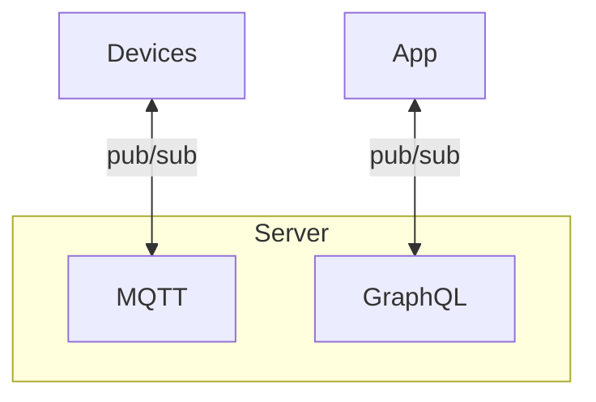

# GraphQL MQTT Server

## Features

**GraphQL Queries:**

- `messages`: Get messages with optional topic filtering
- `topics`: Get all available topics
- `messageCount`: Get message count by topic

**GraphQL Mutations:**

- `sendMessage`: Send a message to an MQTT topic
- `subscribeToMqttTopic`: Subscribe to new MQTT topics
- `clearMessages`: Clear stored messages

**GraphQL Subscriptions:**

- `messageStream`: Real-time stream of MQTT messages
- `topicActivity`: Notifications about topic activity changes

**MQTT Integration:**

- Connects to MQTT broker
- Publishes messages to topics
- Subscribes to topics with wildcard support
- Handles real-time message processing

## Diagrame



## Installation

```bash
uv pip install -U -r pyproject.toml
```

## Usage

1. **Start an MQTT broker** (like Mosquitto):

   ```bash
   mosquitto -p 1883
   ```

2. **Run the server**:

   ```bash
   python main.py
   ```

3. **Access GraphQL playground** at: <http://localhost:8000/graphql>

## Example GraphQL Operations

**Query messages:**

```graphql
query {
  messages(topic: "test/messages", limit: 10) {
    id
    topic
    content
    timestamp
    sender
  }
}
```

**Send a message:**

```graphql
mutation {
  sendMessage(messageInput: {
    topic: "test/messages"
    content: "Hello from GraphQL!"
    sender: "user1"
  }) {
    id
    topic
    content
    timestamp
  }
}
```

**Subscribe to messages:**

```graphql
subscription {
  messageStream(topic: "test/messages") {
    id
    topic
    content
    timestamp
    sender
  }
}
```

**Or publish via MQTT client**:

   ```bash
   mosquitto_pub -h localhost -t "test/messages" -m "External message"
   ```
