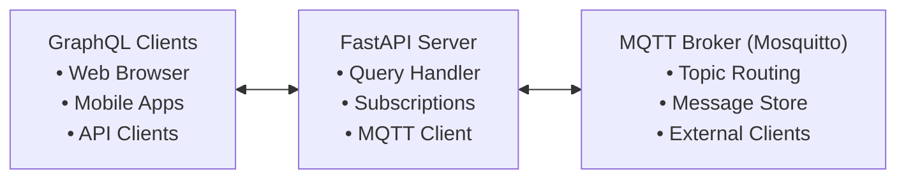

# GraphQL MQTT Server

A real-time GraphQL server with MQTT integration for topic-based messaging. This server allows you to interact with MQTT brokers through GraphQL queries, mutations, and subscriptions.

## Features

- **GraphQL API** for MQTT messaging
- **Real-time subscriptions** for live message streaming
- **Topic-based operations** (query, send, subscribe)
- **MQTT broker integration** with automatic reconnection
- **WebSocket support** for GraphQL subscriptions
- **In-memory message storage** (easily replaceable with database)
- **External MQTT client compatibility**

## Quick Start

### Prerequisites

- Python 3.8+
- MQTT broker (e.g., Mosquitto)

### Installation

1. **Clone or download the server file**

2. **Install dependencies:**

```bash
pip install strawberry-graphql[fastapi] paho-mqtt uvicorn
```

3. **Start an MQTT broker** (if you don't have one):

```bash
# Using Docker
docker run -it -p 1883:1883 eclipse-mosquitto:2.0

# Or install Mosquitto locally
# Ubuntu/Debian: sudo apt-get install mosquitto
# macOS: brew install mosquitto
# Windows: Download from https://mosquitto.org/download/
```

4. **Run the GraphQL server:**

```bash
python main.py
```

The server will start at:

- **GraphQL Playground:** http://localhost:8000/graphql
- **WebSocket subscriptions:** ws://localhost:8000/graphql

## GraphQL API

### Queries

#### `queryTopic(topic: String!, limit: Int = 50)`

Get messages from a specific topic.

```graphql
query {
  queryTopic(topic: "sensors/temperature") {
    id
    content
    timestamp
    sender
  }
}
```

#### `queryAllTopics()`

Get information about all available topics with statistics.

```graphql
query {
  queryAllTopics {
    name
    messageCount
    lastMessageTime
    isSubscribed
  }
}
```

#### `querySubscribedTopics()`

List all currently subscribed MQTT topics.

```graphql
query {
  querySubscribedTopics
}
```

### Mutations

#### `sendToTopic(input: SendToTopicInput!)`

Send a message to an MQTT topic.

```graphql
mutation {
  sendToTopic(input: {
    topic: "alerts/system"
    content: "System maintenance scheduled"
    sender: "admin"
  }) {
    id
    timestamp
    content
  }
}
```

#### `subscribeToTopic(topic: String!)`

Subscribe to an MQTT topic for receiving messages.

```graphql
mutation {
  subscribeToTopic(topic: "sensors/+")
}
```

#### `unsubscribeFromTopic(topic: String!)`

Unsubscribe from an MQTT topic.

```graphql
mutation {
  unsubscribeFromTopic(topic: "sensors/temperature")
}
```

#### `clearTopicMessages(topic: String!)`

Clear all messages from a specific topic.

```graphql
mutation {
  clearTopicMessages(topic: "test/messages")
}
```

#### `createTestData()`

Create sample test messages for development/testing.

```graphql
mutation {
  createTestData
}
```

### Subscriptions

#### `subscribeTopicMessages(topic: String!)`

Real-time subscription to messages from a specific topic.

```graphql
subscription {
  subscribeTopicMessages(topic: "sensors/temperature") {
    content
    timestamp
    sender
    topic
  }
}
```

#### `subscribeAllTopicMessages()`

Real-time subscription to messages from all topics.

```graphql
subscription {
  subscribeAllTopicMessages {
    content
    timestamp
    sender
    topic
  }
}
```

#### `subscribeTopicActivity()`

Get notifications when new topics become active.

```graphql
subscription {
  subscribeTopicActivity
}
```

## Data Types

### Message

```graphql
type Message {
  id: String!
  topic: String!
  content: String!
  timestamp: DateTime!
  sender: String
}
```

### TopicInfo

```graphql
type TopicInfo {
  name: String!
  messageCount: Int!
  lastMessageTime: DateTime
  isSubscribed: Boolean!
}
```

### SendToTopicInput

```graphql
input SendToTopicInput {
  topic: String!
  content: String!
  sender: String
}
```

## Testing the Server

### 1. Create Test Data

```graphql
mutation {
  createTestData
}
```

### 2. Query Topics

```graphql
query {
  queryAllTopics {
    name
    messageCount
    isSubscribed
  }
}
```

### 3. Send a Message

```graphql
mutation {
  sendToTopic(input: {
    topic: "test/hello"
    content: "Hello World!"
    sender: "user1"
  }) {
    id
    timestamp
  }
}
```

### 4. Subscribe to Messages

```graphql
subscription {
  subscribeTopicMessages(topic: "test/hello") {
    content
    sender
    timestamp
  }
}
```

## External MQTT Client Integration

The server works with any MQTT client. Messages from external clients will automatically appear in GraphQL queries and subscriptions.

### Publishing with mosquitto_pub

```bash
mosquitto_pub -h localhost -t "sensors/temperature" -m "23.5°C"
```

### Subscribing with mosquitto_sub

```bash
mosquitto_sub -h localhost -t "sensors/+"
```

## Configuration

### MQTT Broker Settings

Edit the `lifespan` function in `main.py`:

```python
# Connect to MQTT broker
mqtt_handler.connect_to_broker(host="your-broker-host", port=1883)
```

### Default Topics

The server subscribes to these topics by default:

- `test/messages`
- `sensors/+` (wildcard for all sensor topics)

### Server Settings

```python
uvicorn.run(
    "main:app",
    host="0.0.0.0",    # Change to "127.0.0.1" for local only
    port=8000,         # Change port if needed
    reload=True,       # Set to False in production
    log_level="info"
)
```

## Architecture



## Message Flow

1. **Incoming MQTT messages** → Stored in memory → Available via GraphQL queries
2. **GraphQL mutations** → Published to MQTT → Received back via MQTT callback
3. **Real-time subscriptions** → Fed from internal message queue
4. **External MQTT clients** → Messages appear automatically in GraphQL

## Development

### Project Structure

```
├── main.py              # Main server file
├── README.md           # This file
└── pyproject.txt    # Dependencies (optional)
```

### Adding Database Storage

Replace the in-memory `messages_store` with your database of choice:

```python
# Example with SQLAlchemy
from sqlalchemy import create_engine
from sqlalchemy.orm import sessionmaker

# Replace messages_store operations with database calls
```

### Custom MQTT Message Formats

The server handles both:

- **Structured JSON messages** (from GraphQL clients)
- **Plain text messages** (from external MQTT clients)

## Troubleshooting

### Common Issues

**No data in queries:**

```graphql
# First create test data
mutation { createTestData }

# Then query
query { queryAllTopics { name messageCount } }
```

**Subscriptions not working:**

- Ensure WebSocket connection is established
- Check browser developer tools for connection errors
- Verify MQTT broker is running and accessible

**MQTT connection failed:**

- Check if MQTT broker is running: `netstat -an | grep 1883`
- Verify broker host/port configuration
- Check firewall settings

**Messages not appearing:**

- Verify topic subscription: `querySubscribedTopics`
- Check server logs for connection issues
- Test with external MQTT client first

### Debug Mode

The server includes extensive logging. Check console output for:

- MQTT connection status
- Message processing
- Subscription events
- Queue operations

## Production Deployment

### Security Considerations

- Use authentication for MQTT broker
- Add GraphQL query complexity limits
- Implement rate limiting
- Use HTTPS/WSS in production
- Add input validation and sanitization

### Performance

- Replace in-memory storage with database
- Add message persistence
- Implement message archiving
- Add monitoring and metrics
- Use Redis for message queuing

### Docker Deployment

```dockerfile
FROM python:3.13-slim

# Install uv using the official installer
RUN apt-get update && apt-get install -y curl \
    && curl -LsSf https://astral.sh/uv/install.sh | sh \
    && apt-get clean && rm -rf /var/lib/apt/lists/*

# Add uv to PATH (installs to ~/.local/bin by default)
ENV PATH="/root/.local/bin:$PATH"

WORKDIR /app

# Copy project files first for dependency install
COPY pyproject.toml .

# Install dependencies using uv
RUN uv pip install --system .

# Copy the rest of the application
COPY . .

EXPOSE 8000

CMD ["python", "main.py"]

```

## License

MIT License - Feel free to use in your projects!
